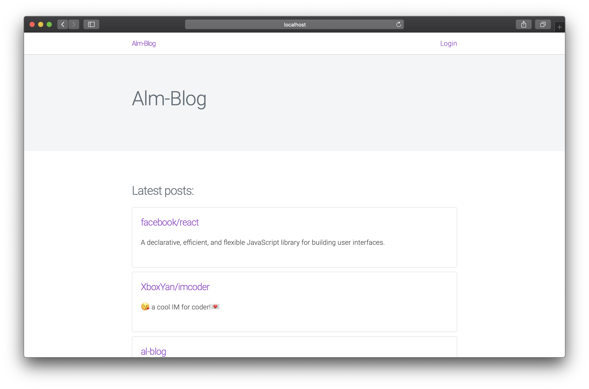
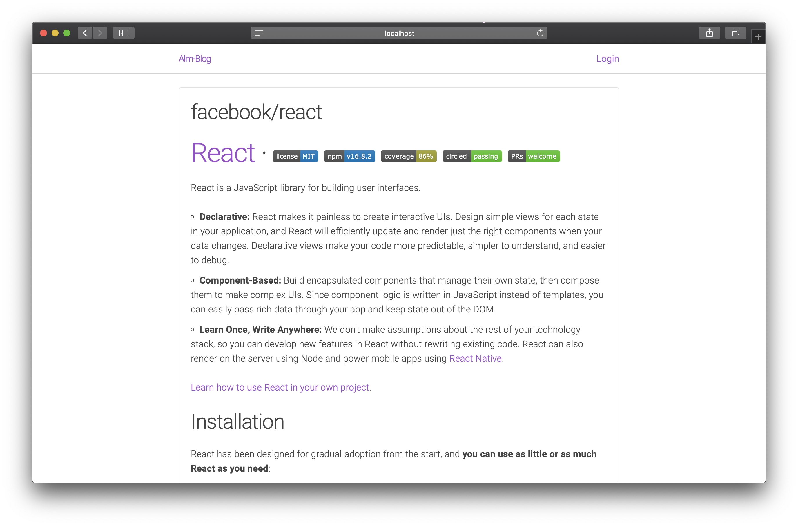

# Al-Blog
🚧 Work in progress  

This is my full-stack personal blog build with: `Express`, `React`.  
Posts are saved in markdown format and renders with `react-markdown`

## Screenshots

<p align="center">
    
    
</p>

## Usage:

- Run frontend
```
$ git clone https://github.com/AlexMubarakshin/al-blog.git
$ cd ./al-blog/frontend
$ npm i
$ npm start
```
- Run backend
```
$ cd ./al-blog/backend
```

Rename `.env.example` to .env and paste your params.

```
$ npm i
$ npm start

# Visit localhost:3000
```
